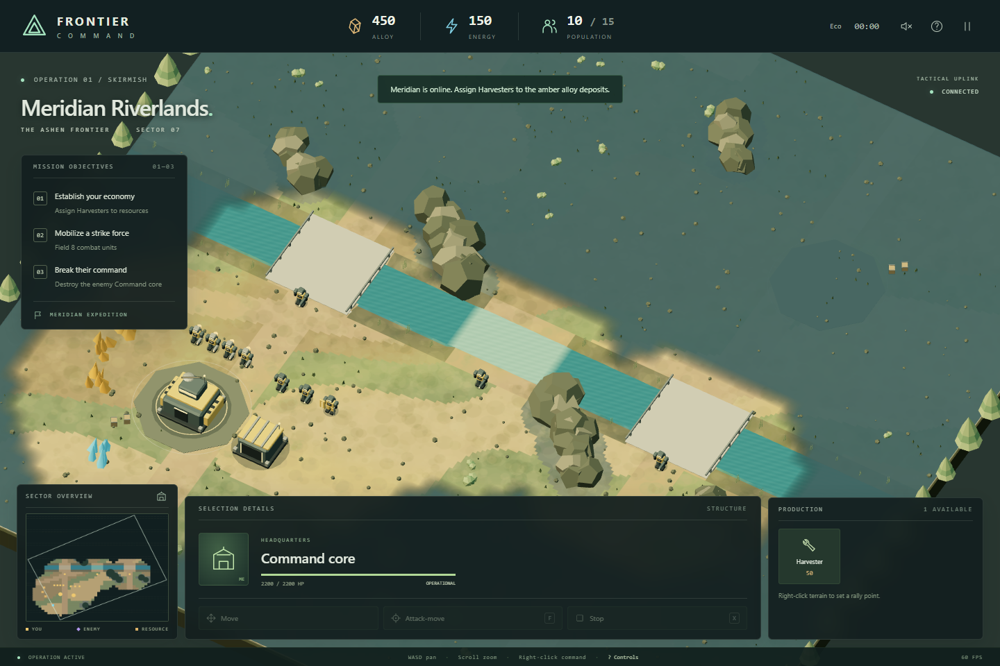

# Frontier Command

An original stylized 3D RTS inspired by economic base-building and tactical unit combat.

[Play on desktop, phone, or tablet](https://buicongnguyen.github.io/3d_astra/). Touch controls include tap commands, drag pan, pinch zoom, and portrait/landscape layouts.



- **Active project:** [`github-io/`](github-io/) — Three.js browser game with Blender-generated assets, built for GitHub Pages.
- **Browser implementation plan:** [`github-io/PLAN.md`](github-io/PLAN.md).
- **Logic and code review:** [`github-io/CODE_REVIEW.md`](github-io/CODE_REVIEW.md).
- **Deferred project:** [`GODOT_BLENDER_PLAN.md`](GODOT_BLENDER_PLAN.md) — Godot + Blender implementation to undertake later.
- **Original design:** [`RTS_GAME_PLAN.md`](RTS_GAME_PLAN.md).

## Run the browser game

```sh
cd github-io
npm ci
npm run dev
```

Open the local address printed by Vite. `npm run build` creates the static site in `github-io/dist/`. No server, API keys, accounts, or external asset services are needed by the deployed game.

See the browser project's README for controls, assets, tests, and deployment.
